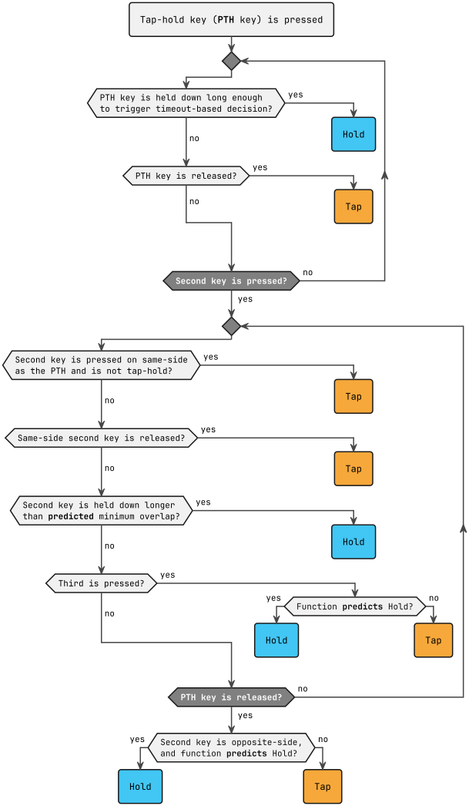
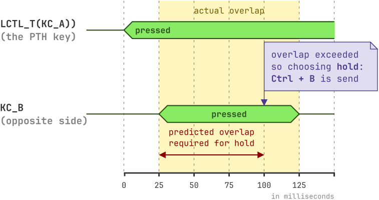
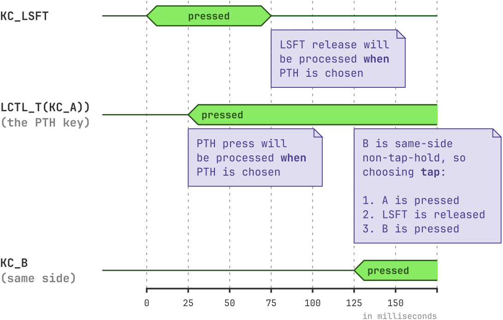

# Predictive Tap-Hold for QMK


## Introduction

Traditionally, tap-hold keys, like `LCTL_T(KC_A)` (Mod-Tap) or `LT(1, KC_S)` (Layer-Tap), rely on a global `TAPPING_TERM`. This timer creates a fundamental trade-off:

* A **short `TAPPING_TERM`** is responsive for taps and holds but often causes accidental holds.
* A **long `TAPPING_TERM`** prevents accidental holds but makes them also hard to activate.

While many options exist to improve this, they often require a lot of careful fine-tuning, and in the end, it can still feel like you have to adapt *more* to the algorithm rather than the other way around.

**Predictive Tap-Hold (PTH)** replaces this with a state machine that uses prediction functions in ambiguous cases. It analyzes typing behavior — including event sequence, timing, and hand position — to better distinguish between a tap and a hold. Basically, PTH aims to be like an effective autofocus, making setups like home-row mods more intuitive and easier to adopt.

Of course, no autofocus is perfect, and [neither is this](#prediction-performance). To deal with any edge cases or anything else that doesn't fit your typing style, PTH is highly configurable, allowing you to inspect and tune its behavior. It defaults to an ergonomic bilateral model but can be configured for same-hand holds and other custom behaviors.

## Features

For the rest of this document, **PTH key** refers to the first tap-hold key that is pressed, when no other tap-hold key is being processed yet by the PTH mechanism.

* **[Instant Hold](#instant-hold):** By default, PTH will provisionally activate the hold function (e.g., apply a modifier or switch a layer) the moment you press the PTH key. If the final decision is a tap, this provisional hold is automatically undone. This is useful, for example, when you want to zoom with an `LCTL_T` key and your scroll wheel. Without this feature, you'd have to wait until hold was chosen. With it, zooming works instantly. Instant `LT` is useful for the same reason if you activate some function in your `keymap.c` when its layer is active.

* **[Fast Streak Tap](#fast-streak-tap):** When enabled, PTH can detect if you're in the middle of a typing streak. If a tap-hold key is pressed during a streak, it will immediately resolve it as a tap, making your typing feel snappy. This is equivalent to QMK's [Flow Tap](https://docs.qmk.fm/tap_hold#flow-tap) or ZMK's [require-prior-idle-ms](https://zmk.dev/docs/keymaps/behaviors/hold-tap#require-prior-idle-ms).

* **Full Compatibility:** PTH aims to be compatible with other QMK features like Tap Dance and Combos. PTH works with Vial. Multiple tap-hold keys can be held at the same time. The order of key presses and releases are preserved [where possible](#order-of-events). Key events are processed as usual, so you can react to them in `process_record_user` and the like. PTH can even be used together with standard QMK tap-hold. Reports about any issues are welcome. 🐞

* **High Responsiveness:** PTH is designed for both reliability and speed. In a test over multiple weeks, the median time from key press to decision (tap vs. hold) when a second key was involved was 195 ms, and 223 ms for hold decisions. Of course, everyone types differently.

* **Focus on Ergonomics:** By only activating a hold when your next keystroke comes from the opposite hand, PTH reduces same-hand chording fatigue. A tap-hold like `RCTL_T(KC_F)` on your right hand only becomes <kbd>Ctrl</kbd> when you press a key like `KC_C` on the left hand (for <kbd>Ctrl</kbd>+<kbd>C</kbd>). **That said**, hold can be activated when a third key is pressed, and you can very easily make any keys behave, [as if they're on the opposite side as the PTH](#side-options).

* **Customizability:** Have a key send <kbd>Ctrl</kbd>+<kbd>C</kbd> [instead of the hold action](#register-keycode-on-hold). Disable [instant hold for a specific Layer-Tap](#instant-hold), so that you could press it and a Mod-Tap in any order. [Force a decision](#timeout-behavior) on press or after a timeout. Make it [less likely that hold is chosen](#user-bits) for certain keys.

---

⏭️ [**Click here**](#getting-started) to skip to the installation.

## Decision Logic

At its heart, PTH operates on a few key principles in its default configuration:

* **No Static Timeouts:** Apart from [forcing a decision after a long time](#timeout-behavior) without another key press (700 ms by default), decisions are made without static timeouts.

* **Tap is the Default:** Pressing and releasing a tap-hold key *by itself* results in a **tap** action.

* **Hold is Contextual:** A **hold** action is triggered only when previous and subsequent key presses create a context that indicates a hold was intended. This context is determined by:
    * **Timing:** The duration between the PTH key press and other key events.
    * **Sequence:** Which keys are pressed or released after the PTH key.
    * **Hand Position:** Whether subsequent keys are on the same or opposite hand.
    * **Predictions:** For ambiguous cases, prediction functions — [evolved from actual typing data](https://github.com/jgandert/evolve_tap_hold_predictors) — make an educated guess to resolve the user's intent using any available data.

* **Immediate once Chosen:** Once a decision has been made, every key press (tap-hold or not) is instantaneous. If hold is chosen, opposite-side tap-holds become taps and same-side tap-holds become holds.

The following diagram gives an overview of how a decision is made with the **default** config:



The following section goes into more detail about the overlap prediction.

### Overlap Duration Prediction

When the second key is pressed, and its on the opposite side or a tap-hold, a function estimates the duration that both keys have to be pressed simultaneously (the overlap) for it to count as a hold. That duration can be low, if the data makes it likely this is a hold, and high, if this is likely to be a tap. If they're not pressed down together for the predicted duration, then the other prediction functions will handle the case.



## Getting Started

### Step 1: Add the modules

Follow [**the steps described in the parent README**](../README.md) to add this repository to your QMK or userspace, and this module to your `keyboard.json`.

### Step 2: Configure `config.h`

For PTH to work effectively, it must get the key events as soon as they are created. For that you must set the tapping term to `0` for the keys it will manage. The simplest way is to set it globally:

```c
#define TAPPING_TERM 0
```

[Further down in this document](#usage-with-qmks-tap-hold-logic), there are steps for using PTH together with the standard QMK tap-hold logic.

### Step 3: Update `keymap.c`

PTH must know which keys belong to which hand. Define the `pth_side_layout` array using the same `LAYOUT` macro as your keymaps. For a standard bilateral layout, you'll use `PTH_L` for left-hand keys and `PTH_R` for right-hand keys.

```c
const uint8_t pth_side_layout[MATRIX_ROWS][MATRIX_COLS] PROGMEM = LAYOUT(
    PTH_L, PTH_L, PTH_L, PTH_L, PTH_L,     PTH_R, PTH_R, PTH_R, PTH_R, PTH_R, PTH_R,
    PTH_L, PTH_L, PTH_L, PTH_L, PTH_L,     PTH_R, PTH_R, PTH_R, PTH_R, PTH_R, PTH_R,
    PTH_L, PTH_L, PTH_L, PTH_L, PTH_L,     PTH_R, PTH_R, PTH_R, PTH_R, PTH_R, PTH_R,
    
                 PTH_L, PTH_L, PTH_L,     PTH_R, PTH_R, PTH_R
);
```

Alternatively, you can implement the `pth_get_side` function, as shown in the [**Hand Assignment**](#hand-assignment) section.

> [!TIP]
> There are other values you can use besides left and right. For example, you can return `PTH_S` so that a key always acts as if it's on the same side as any other key. This is like using `*` in [Chordal Hold](https://docs.qmk.fm/tap_hold#chordal-hold)'s layout. For a complete list of all options, see the [**Side Options**](#side-options) section. See the [User Bits](#user-bits) section for how to make holds less likely on certain keys.

✅ Your keyboard is now ready to be compiled and flashed.

### Usage with QMK's Tap-Hold Logic

You don't have to go all-in. You can use PTH for some keys and QMK's standard `TAPPING_TERM` logic for others.

1. In `config.h`, remove `#define TAPPING_TERM 0` and instead enable per-key tapping terms:
   ```c
   #define TAPPING_TERM_PER_KEY
   ```

2. In `keymap.c`, implement the `get_tapping_term` function. Return `0` for keys you want PTH to handle, and a normal tapping term for others.
   ```c
   uint16_t get_tapping_term(uint16_t keycode, keyrecord_t* record) {
       switch (keycode) {
           // These keys will use the standard QMK logic with a 130 ms term
           case SFT_T(KC_SPC):
           case LT(1, KC_GRV):
               return 130;
   
           // All other tap-hold keys will fall through to the default
           // and be handled by PTH logic.
           default:
               return 0;
       }
   }
   ```

## Customization

You can customize PTH's behavior by adding any of the following options to your `config.h` or by implementing any of the "weak" functions in your `keymap.c`.

### `config.h` Options

* `#define PTH_RESET_IMMEDIATELY_WHEN_TAP_CHOSEN`
  By default, when tap is chosen, PTH enters a `PTH_DECIDED_TAP` state, which treats subsequent overlapping tap-hold keys as taps until the PTH is released. This is the default, as [for most people](https://github.com/jgandert/analyze_keystrokes/blob/main/README.md#counts-per-overlap-type) a normal key like `KC_E` rarely overlaps with a modifier like `KC_LCTL` (only 0.73 % of the training data). However, depending on your typing style, it may be slightly harder to activate holds. If you define this, PTH will instead immediately reset its state. As a result, if the next key is a tap-hold, it will become the new PTH key and thus be evaluated using the normal PTH processing, even if the *now previous* PTH key is still pressed.

* `#define PTH_FAST_STREAK_TAP_ENABLE`
  Enables [Fast Streak Tap](#fast-streak-tap), so that tap-holds will be resolved as taps when a typing streak is detected.

* `#define PTH_FAST_STREAK_TAP_RESET_IMMEDIATELY`
  Same as `PTH_RESET_IMMEDIATELY_WHEN_TAP_CHOSEN` but only applies to Fast Streak Taps.

* `#define PTH_INSTANT_MOD_TAP_SUPPRESSION_KEY KC_F23`
  This defines the keycode sent to "neutralize" a modifier (like <kbd>Alt</kbd>) if PTH was held instantly but the final decision was a tap. This prevents lone modifiers from having an effect, such as causing OS menus to appear. `KC_F23` is a safe default as it's rarely used, but you can change it to another key.

* `#define PTH_MS_MAX_OVERLAP 232`
  When a PTH key is pressed, followed by a tap-hold on the same hand or any key on the opposite hand, a prediction function estimates the minimum overlap time (both keys down simultaneously) that is required to consider the PTH key a hold. This value acts as an upper cap on that prediction. You should not need to change this.

* `#define PTH_MS_MIN_OVERLAP 39`
  This sets the minimum overlap time (in milliseconds) required for a key combination to be considered a hold. This helps prevent accidental holds from overlapping key rolls.

### `keymap.c` Functions

You can override any of the following functions by adding your own implementation to `keymap.c`.

#### Hand Assignment

`uint8_t pth_get_side(keyrecord_t* record)`

* **What it does:** Determines the "sidedness" of a key. This is an alternative to the `pth_side_layout` array.
* **Default behavior:** Uses the `pth_side_layout` array to determine the side.
* **When to override:** If you need programmatic side assignment for keys.
* **Return value:** It should return an `pth_side_t` value, possibly with additional [user bits](#user-bits) set. The most important are `PTH_L` for the left hand and `PTH_R` for the right hand. See the next section for a table of all options.
* **Example:** This is an alternative to the array that works in many cases.
  ```c
  uint8_t pth_get_side(keyrecord_t* record) {
      keypos_t pos = record->event.key;
      bool is_left;

  #ifdef SPLIT_KEYBOARD
      is_left = pos.row < MATRIX_ROWS / 2;
  #else
      is_left = (MATRIX_COLS > MATRIX_ROWS)
                  ? pos.col < MATRIX_COLS / 2
                  : pos.row < MATRIX_ROWS / 2;
  #endif

      return is_left ? PTH_L : PTH_R;
  }
  ```

##### Side Options

Each key can define, on which side it "pretends" to be, separately for each of two cases:

1. **PTH key:** The key is the main predictive tap-hold key being evaluated.
2. **Any Subsequent keys:** The key is another key being pressed while the PTH key is active.

For example, a key with `PTH_LR` will behave as if it's _left_ when it's the main PTH key, and _right_, when it isn't. If the PTH has `PTH_LR` and the second key has `PTH_*L` (e.g. `PTH_RL`) then `is_same_side_as_pth` will return `true`, because they're both effectively left.

A key with `PTH_O` will act as if it's on the opposite side in either case. However, if the PTH key has `PTH_O*` or `PTH_S*`, and the other key has too, the other's side will have priority. For example, when the second key has `PTH_LS`, then both keys will be considered the same (`is_same_side_as_pth` will return `true`), whatever the value of the PTH key.

Here are all options:

| `pth_side_t` | Behavior as PTH Key | Behavior as Other Key |
|:-------------|:--------------------|:----------------------|
| `PTH_L`      | Left                | Left                  |
| `PTH_R`      | Right               | Right                 |
| `PTH_O`      | Opposite            | Opposite              |
| `PTH_S`      | Same                | Same                  |
| `PTH_LR`     | Left                | Right                 |
| `PTH_LO`     | Left                | Opposite              |
| `PTH_LS`     | Left                | Same                  |
| `PTH_RL`     | Right               | Left                  |
| `PTH_RO`     | Right               | Opposite              |
| `PTH_RS`     | Right               | Same                  |
| `PTH_OL`     | Opposite            | Left                  |
| `PTH_OR`     | Opposite            | Right                 |
| `PTH_OS`     | Opposite            | Same                  |
| `PTH_SL`     | Same                | Left                  |
| `PTH_SR`     | Same                | Right                 |
| `PTH_SO`     | Same                | Opposite              |

##### User Bits

The `pth_side_t` values only use the lower 4 bits of the `uint8_t`. You can use the upper 4 "user" bits in `pth_get_side` and `pth_side_layout` for your own flags. For example, you could `#define MY_FLAG PTH_TO_USER_BITS(4)` and then use `PTH_L | MY_FLAG` in your layout. You can then retrieve this value in your custom functions using `pth_get_pth_side_user_bits()` for the PTH, or `PTH_GET_USER_BITS(pth_get_side(record))` for any record.

Despite the "user" in the name, PTH provides the following constants by default:

| User Bits | Value                 | Multiplier | Effect                   |
|-----------|-----------------------|-----------:|--------------------------|
| `PTH_5H`  | `PTH_TO_USER_BITS(1)` |       0.95 | Hold becomes 5 % harder  |
| `PTH_10H` | `PTH_TO_USER_BITS(2)` |       0.90 | Hold becomes 10 % harder |
| `PTH_15H` | `PTH_TO_USER_BITS(3)` |       0.85 | Hold becomes 15 % harder |

In your `pth_side_layout` or `pth_get_side`, you can simply combine these with the side options using a bitwise OR (`|`):

  ```c
  const uint8_t pth_side_layout[MATRIX_ROWS][MATRIX_COLS] PROGMEM = LAYOUT(
      PTH_S | PTH_10H, PTH_L | PTH_5H, PTH_L, ..., PTH_R, PTH_R | PTH_5H, PTH_S | PTH_10H,
      ...
  );
  ```

If you'd like to use the whole 4 bits for something else, you can easily disable this:

  ```c
  float pth_get_prediction_factor_for_hold(void) {
      return 1.0f;
  }
  ```

See the [Prediction Factor](#prediction-factor) section for an example of defining additional user bits to further bias the prediction functions.

#### Instant Hold

Add `#define PTH_DONT_HOLD_INSTANTLY` to your config.h to disable it.

`bool pth_should_hold_instantly(uint16_t keycode, keyrecord_t* record)`

* **What it does:** Decides if a PTH key should activate its "hold" function immediately on press.
* **Default behavior:** Returns `true` unless any of these apply:
    * [Caps Word](https://docs.qmk.fm/features/caps_word) is active.
    * The PTH is a Mod-Tap that contains the GUI modifier, or it contains another modifier that is already active. See below for an explanation.
* **When to override:** To selectively enable or disable instant hold for specific keys.
* **Example:** This is the default as defined in `pth_default_should_hold_instantly`.
  ```c
  bool pth_should_hold_instantly(uint16_t keycode, keyrecord_t* record) {
  #ifdef CAPS_WORD_ENABLE
      // Instantly holding will result in a held tap-hold key being processed,
      // thus breaking caps words.
      if (is_caps_word_on()) {
          return false;
      }
  #endif

      // It seems there are only downsides to instant holding GUI.
      const uint8_t active_mods_or_gui = pth_get_all_8_bit_mods() | MOD_MASK_GUI;
      if (pth_is_mod_tap_with_any_mods_of(keycode, active_mods_or_gui)) {
          return false;
      }

      return true;
  }
  ```

**Explanation for the workaround:**

QMK reports a modifier release to the OS if a key with multiple modifiers is released, even if another key with one or multiple of those modifiers is still down.

Example with `LCS_T(KC_E)` aka `MT(MOD_LCTL | MOD_LSFT, KC_E)`:

| Nr | Event              | Effect                                                                                          |
|---:|:-------------------|:------------------------------------------------------------------------------------------------|
|  1 | `KC_LSFT` down     | QMK reports to the OS that left <kbd>Shift</kbd> is pressed.                                    |
|  2 | `LCS_T(KC_E)` down | QMK reports that <kbd>Ctrl</kbd> is pressed.                                                    |
|  3 | `LCS_T(KC_E)` up   | QMK reports that left <kbd>Shift</kbd> is released, **even though** `KC_LSFT` is still pressed. |
|  4 | `KC_T` down        | A lowercase `t` is typed, because to the OS <kbd>Shift</kbd> is already up.                     |

The workaround avoids situations like this by disabling instant hold if a modifier that would be included in the instant hold is already active.

A full workaround in your own keymap is to use the right version on bare modifier keys (e.g. `KC_RSFT`), and the left version of modifiers on all tap-hold keys (e.g. `LCS_T(KC_A)`) or vice versa. It works because modifiers of different sides don't affect each other. If a left mod is down, and then a right mod is up, the release of the left mod will still be reported to the OS when it happens.

---

`bool pth_second_should_hold_instantly(uint16_t second_keycode, keyrecord_t* second_record)`

* **What it does:** Decides if a *second* overlapping tap-hold key should also be held instantly.
* **Default behavior:** Calls `pth_should_hold_instantly` for the second key.
* **When to override:** If you want a different instant hold logic for the second key. For instance, you might never want a second key to hold instantly.

#### Neutralize Mods When Instant Hold was Wrong

`bool pth_should_neutralize_mods(uint8_t mod_5_bit)`

* **What it does:** Decides if a modifier from an instant-hold key should be "neutralized" if the final decision is a tap. This is for modifiers like <kbd>Alt</kbd> that can trigger actions when they're pressed on their own.
* **Default behavior:** Returns `true` for any modifier combination that does *not* include <kbd>Ctrl</kbd> or <kbd>Shift</kbd>. Neutralizing them is usually not necessary and, in the case of <kbd>Ctrl</kbd>, can cause control characters to be output in certain consoles.
* **When to override:** If you want to change which modifiers get neutralized, for example, to also neutralize <kbd>Ctrl</kbd>.

#### Register Keycode on Hold

`uint16_t pth_get_code_to_be_registered_instead_when_hold_chosen(void)`

* **What it does:** Returns a basic keycode that will be registered when hold is chosen. That keycode will be unregistered the moment the PTH is released.
* **Note:** Instant hold is automatically disabled for any key that returns a value other than `KC_NO`.
* **Default behavior:** Returns `KC_NO`, resulting in normal Mod-Tap or Layer-Tap behavior.
* **Example:** When tap is chosen, type <kbd>R</kbd>. When hold is chosen, send <kbd>Ctrl</kbd>+<kbd>C</kbd>.
  ```c
  uint16_t pth_get_code_to_be_registered_instead_when_hold_chosen(void) {
      if (pth_get_pth_keycode() == LT(0, KC_R)) {
          return C(KC_C);
      }
      return KC_NO; // Default behavior for all other keys
  }
  ```

#### Choose Tap on Same-Side Events

`bool pth_should_choose_tap_when_second_is_same_side_press(void)`

* **What it does:** Determines if pressing a second key on the same side as an active PTH key should immediately resolve the PTH key as a tap.
* **Default behavior:** Returns `true` if the second key is *not* a tap-hold key on the current layer. This is effective for handling fast key rolls where the PTH key is likely intended as a tap. Even if the PTH key is an `LT` and was instantly held, the logic correctly checks if the second key is a tap-hold on the *new* layer.
* **When to override:** To change the logic for same-side presses, for example, if you want same-side non-tap-hold keys to be handled by the normal prediction logic instead of causing an immediate tap.
* **Example:** This is the default.
  ```c
  bool pth_should_choose_tap_when_second_is_same_side_press(void) {
        return !pth_is_second_tap_hold();
  }
  ```

---

`bool pth_should_choose_tap_when_second_is_same_side_release(void)`

* **What it does:** Called when a same-side second key is *released* before a third key is pressed and before a decision is made. That means the sequence is PTH press, second press and release.
* **Default behavior:** Returns `true`, because by default, same-side presses are intended for taps or holds, but a hold on its own rarely makes sense.
* **When to override:** To prevent this from automatically triggering a tap.

#### Timeout Behavior

The following two functions work as a pair to create a timeout-based decision.

`int16_t pth_get_timeout_for_forcing_choice(void)`

* **What it does:** Sets a timeout (in milliseconds). If the PTH key is held for this long without a decision, PTH will force one.
* **Default behavior:** Returns `700`.
* **Return Values:**
    * `-1`: Disable the timeout for the key.
    * `0`: Decide immediately when the key is pressed.
    * `>0`: Wait that many milliseconds. The highest valid value is `4095`.
* **When to override:** If you want the timeout to depend on the key, for example. It is recommended to use a high value in most cases, because that way the prediction machinery always has enough time to do its job.

---

`pth_status_t pth_get_forced_choice_after_timeout(void)`

* **What it does:** Depending on the return value, it can force a decision when the timeout from the above function expires.
* **Default behavior:** Returns `PTH_DECIDED_HOLD` if no second keycode has been pressed yet. Once a second keycode has been pressed, a decision will soon happen anyway, and it will likely be better, as it's based on more information.
* **Why is Hold the default?** Hold is the default because it is more intuitive: You hold the key, so well, choose hold. Furthermore, it works better with Layer-Taps, where you activate a layer and then press many keys on that layer. Sometimes, we press `LT`, but are still thinking about which key to press, and suddenly the timeout has already passed. With tap as a default, we would feel the need to rush.
* **Return Values:**
    * `PTH_DECIDED_HOLD`: Force a hold decision.
    * `PTH_DECIDED_TAP`: Force a tap decision.
    * Any other value: Do nothing and let the standard logic continue to handle the case.
* **Example:** `RETRO_TAPPING`-like behavior → tap chosen if PTH pressed alone. Note that tap is already selected when the PTH is released before any other key is pressed and before the timeout runs out.
  ```c
  pth_status_t pth_get_forced_choice_after_timeout(void) {
      if (pth_get_second_keycode() == KC_NO) {
          return PTH_DECIDED_TAP;
      }
      return PTH_IDLE;
  }
  ```

#### Register as Hold when Second is Same-Side

`bool pth_should_register_as_hold_when_same_side(uint16_t keycode, keyrecord_t* record)`

* **What it does:** When hold is chosen, this is called for any subsequent tap-hold keys on the same side as the PTH key to decide how they should be registered.
* **Default behavior:** Returns `true` to allow chording same-side tap-hold keys.
* **Return Values:**
    * `true`: The subsequent same-side key is registered as a hold.
    * `false`: The subsequent same-side key is registered as a tap.

#### Prediction Functions

You can override the following functions to fine-tune the prediction logic.

`bool pth_predict_hold_when_third_press(void)`

* **What it does:** Predicts whether to choose hold when a third key is pressed.
* **Default behavior:** Calls `pth_default_get_hold_prediction_when_third_press()`, multiplies the result by the factor from `pth_get_prediction_factor_for_hold()`, and returns `true` if the final value is > 0.5.
* **When to override:** To implement entirely custom prediction logic that goes beyond simple sensitivity adjustments. For most sensitivity tuning, overriding [`pth_get_prediction_factor_for_hold`](#prediction-factor) is the recommended approach.
* **Example:** Always choose hold for a specific key, `MY_KEY`, when a third key is pressed.
  ```c
    bool pth_predict_hold_when_third_press(void) {
        if (pth_get_pth_keycode() == MY_KEY) {
            return true;
        }
        // Fallback to default behavior for all other keys
        float p = pth_default_get_hold_prediction_when_third_press();
        p *= pth_get_prediction_factor_for_hold();
        return p > 0.5f;
    }
  ```

---

`bool pth_predict_hold_when_pth_release_after_second_press(void)`

* **What it does:** Predicts hold when the PTH key is released after a second key was pressed and is still down.
* **Default behavior:** Calls the default prediction function, multiplies the result by the factor from `pth_get_prediction_factor_for_hold()`, and returns `true` if the result is > 0.5.

---

`bool pth_predict_hold_when_pth_release_after_second_release(void)`

* **What it does:** Predicts hold when the PTH key is released after a second key was also released.
* **Default behavior:** Calls the default prediction function, multiplies the result by the factor from `pth_get_prediction_factor_for_hold()`, and returns `true` if the result is > 0.5.

---

`uint16_t pth_predict_min_overlap_for_hold_in_ms(void)`

* **What it does:** Predicts the minimum overlap time in milliseconds required to consider a sequence a hold.
* **Default behavior:** Gets the factor from `pth_get_prediction_factor_for_hold()`. If the second key is on the same-side as the PTH, it reduces the factor by 10 % (thus making the overlap larger), as same-side presses are more likely to be taps. Then it calls the default prediction function and multiplies its return value with `1 + (1 - factor)`. For example, when the factor is 0.9, then the overlap will be multiplied with `(1 + (1 - 0.9)) = 1.1`.

#### Fast Streak Tap

Be aware that it is disabled by default, because it does have a cost. It does increase the amount of taps that were meant to be holds. Add `#define PTH_FAST_STREAK_TAP_ENABLE` to your `config.h` to enable it.

`bool pth_predict_fast_streak_tap(void)`

* **What it does:** Controls whether the current PTH will be a Fast Streak Tap.
* **Default behavior:** Returns `true` if the *previous* PTH decision was not a hold, `pth_is_fast_streak_tap_key` returns `true` for both the PTH and the key before, and the duration since the previous press is less than 125 ms.
* **When to override:** To make Fast Streak Tap better fit your typing style.
* **Example:** This is the default.
  ```c
  bool pth_predict_fast_streak_tap(void) {
      return (pth_is_fast_streak_tap_key(pth_get_pth_keycode()) &&
              pth_is_fast_streak_tap_key(pth_get_prev_press_keycode()) &&
              pth_get_prev_status() != PTH_DECIDED_HOLD &&
              pth_get_prev_press_to_pth_press_dur() < 125);
  }
  ```

---

`bool pth_is_fast_streak_tap_key(uint16_t keycode)`

* **What it does:** Controls whether the supplied key may take part in a Fast Streak Tap.
* **Default behavior:** Returns `true` if <kbd>Ctrl</kbd>, <kbd>GUI/Windows/Super</kbd> and <kbd>Left Alt</kbd> are not active and the supplied key is one of <kbd>Space</kbd>, <kbd>A</kbd> - <kbd>Z</kbd>, <kbd>.</kbd>, <kbd>,</kbd>, <kbd>;</kbd>, or <kbd>/</kbd>.
* **When to override:** If you use a non-QWERTY layout, you may or may not have to add or remove keycodes.
* **Example:** This is the default.
  ```c
  bool pth_is_fast_streak_tap_key(uint16_t keycode) {
      if ((get_mods() & (MOD_MASK_CG | MOD_BIT_LALT)) != 0) {
          // Disable when non-Shift (and non-right-Alt) mods are active.
          return false;
      }
  
      switch (get_tap_keycode(keycode)) {
          case KC_A ... KC_Z:
          case KC_SPC:
          case KC_DOT:
          case KC_COMM:
          case KC_SCLN:
          case KC_SLSH:
              return true;
      }
      return false;
  }
  ```

---

There are two prediction functions included that you could use in your `pth_predict_fast_streak_tap`:

* `float pth_default_get_fast_streak_tap_prediction(void)`
  This correctly predicted 7.49 % of tap-holds in the training data to be taps. The remaining 92.51 % will be handled by the normal PTH logic, so it can still resolve to tap or hold. Conversely, it mispredicted 0.66 % of the training data as taps.

* `float pth_conservative_get_fast_streak_tap_prediction(void)`
  This correctly predicted 3.46 % of tap-holds in the training data to be taps. The remaining 96.54 % will be handled by the normal PTH logic. Conversely, it mispredicted 0.29 % of the training data as taps.

#### Prediction Factor

`float pth_get_prediction_factor_for_hold(void)`

* **What it does:** Returns a factor to adjust the hold prediction probability. A value less than 1.0 makes holds harder to trigger, while a value greater than 1.0 makes them easier.
* **How it works:**
    * For prediction functions that return a probability (like `pth_predict_hold_...`), the result is multiplied by this factor. A result > 0.5 is considered a hold.
    * For the overlap time prediction (`pth_predict_min_overlap_for_hold_in_ms`), a longer overlap makes a hold *harder*. So, the time is multiplied by `(1 + (1 - factor))`. For example, a factor of `0.85` results in the overlap time being multiplied by `1.15`, requiring a longer overlap.
* **Default behavior:** Returns `0.95` if the [user bits](#user-bits) equal `PTH_5H`, `0.9` for `PTH_10H`, and `0.85` for `PTH_15H`, thus making holds 5 %, 10 %, and 15 % harder respectively.
* **When to override:** To disable the default logic, or to implement custom logic for adjusting hold sensitivity based on the key, layer, or other states.
* **Example:** Make holds even harder on the left pinky, but slightly easier on the right index finger.
  ```c
  // 25 % harder holds
  #define UB_25H PTH_TO_USER_BITS(4)
  
  // 10 % easier holds
  #define UB_10E PTH_TO_USER_BITS(5)

  const uint8_t pth_side_layout[MATRIX_ROWS][MATRIX_COLS] PROGMEM = LAYOUT(
      PTH_L | UB_25H, ..., PTH_R | UB_10E, ...
  );

  float pth_get_prediction_factor_for_hold(void) {
      uint8_t user_bits = pth_get_pth_side_user_bits();
      if (user_bits == UB_25H) {
          return 0.75f;
      }
      if (user_bits == UB_10E) {
          return 1.1f;
      }
      
      // Fallback to default behavior
      uint8_t mp = PTH_GET_USER_BIT_ENCODED_VALUE(user_bits);
      if (mp == 0 || mp > 3) {
          return 1.0f;
      }
      return 1.0f - mp * 0.05f;
  }
  ```

### Getter & Utilities

Here is a selection of the functions that you can use in your custom logic to get information about the current PTH state:

* `pth_get_pth_keycode()`: Get the keycode of the currently active Predictive tap-hold (PTH) key (e.g., `LCTL_T(KC_A)`). Returns `KC_NO` if none is active.
* `pth_get_second_keycode()`: Get the keycode of the second key in the sequence. Returns `KC_NO` if there is no second key.
* `pth_get_pth_record()`: Get the `keyrecord_t` of the active PTH key. Useful for accessing event details like position (`record->event.key`).
* `pth_get_second_record()`: Get the `keyrecord_t` of the second key.
* `pth_get_prev_press_keycode()`: Get the keycode of the key that was pressed just before the PTH key.
* `pth_get_pth_atomic_side()`: Get the relevant part of the PTH's full key side. Compare it with the `PTH_ATOM*` constants (e.g. `PTH_ATOM_LEFT`)
* `pth_get_side(record)`: Get the full side of a key. Call `PTH_SIDE_WITHOUT_USER_BITS` with the result to remove user bits, so you can compare it with the `pth_side_t` values.
* `pth_get_status()`: Get the current status of the PTH state machine (e.g., `PTH_PRESSED`, `PTH_DECIDED_HOLD`).
* `pth_is_processing_internal()`: Returns `true` if the current key event being processed (e.g. in `process_record_user`) was triggered internally by PTH itself.

Check out [`predictive_tap_hold.h`](./predictive_tap_hold.h) for all getter and utility methods.

### Instant Tap Key (for Auto-Repeat)

It can be useful to keep the tap part of a tap-hold key pressed, so that the OS will auto-repeat it (like `QUICK_TAP_TERM` in QMK). For example, if you use <kbd>Backspace</kbd> in a tap-hold, you may wish to hold it down to remove a bunch of text, without having to hammer it repeatedly. Tap-holds have a hard time allowing that, as pressing the keys for a long time usually results in a hold.

One neat way of doing so requires barely any changes to your keymap. Find a conveniently placed key that isn't a tap-hold yet. Let's say `KC_R`. Replace it with a Layer-Tap such as `LT(0, KC_R)`. Do so for each side. Now, when you press that key, and a tap-hold key on the other side, the PTH machinery will run, and hold will be chosen. When hold is chosen, any tap-hold keys on the other side will automatically and instantly be registered as taps. Only when the key is released will it be unregistered.

The reason this works is that in QMK higher layers have priority, and so activating layer `0` does not have any effect, because other higher layers are still active. As a result, the hold part of the tap-hold does nothing except for activating the tap part of tap-holds on the opposite site.

### Tap Keycodes Beyond the Basics

The `kc` argument of Mod-Taps are [limited to the Basic Keycode set](https://docs.qmk.fm/mod_tap#caveats), so you can't use keycodes like `LCTL()`, `KC_TILD`, or any value above `0xFF`.

You can circumvent that with a bit of code:

```c
bool process_record_user(uint16_t keycode, keyrecord_t* record) {
    switch (keycode) {
        // We use F22 as placeholder value.
        case LCS_T(KC_F22):
            // activate Ctrl + Shift when held, left click when tapped
            if (record->tap.count) {
                // tap was chosen
                if (record->event.pressed) {
                    register_code16(KC_BTN1);
                } else {
                    unregister_code16(KC_BTN1);
                }
            }
            return false;
    }
    return true;
}
```

## Order of Events

PTH preserves the order of key releases and presses as much as possible. If <kbd>Shift</kbd> is down while the PTH key is being pressed, then it's normal to expect that <kbd>Shift</kbd> will affect the PTH, even if <kbd>Shift</kbd> is already released when the PTH resolves to hold. For example, if `LCTL_T(KC_H)` is a tap, we rightly expect an uppercase "H".

To achieve that, key releases after the PTH press are cached until the decision is made. When we finally choose hold or tap, the PTH's keycode is actually registered (unless it's an instant hold and hold was chosen). After that, the cached releases will now actually be processed. Before the PTH press, and after the PTH decision, releases are instantaneous!



If we didn't cache the event, the actual release might happen after the PTH press, but before its actual decision, and so <kbd>Shift</kbd> would already be released before the PTH's tap is registered.

> [!NOTE]
> Be aware that instant hold can affect the order!
>
> If the PTH key is pressed and instantly held, then a key X is released (cached but not yet processed), and the second key is pressed and instantly held, the second key will already be held by the time we process the release of X. In reality, X was released _before_ the second key was pressed.
>
> However, that can't really be avoided due to the nature of an instant hold. Also, in practice, it probably doesn't matter because modifiers like <kbd>Shift</kbd> only affect keys at the moment they are pressed down, not afterward. For example, if you hold `KC_E` first and then press <kbd>Shift</kbd> before it's released, the `KC_E` will not be uppercase.

## Prediction Performance

This covers only the cases where prediction functions are used to make a decision. Also note that the training data consists of a lot of participants (more than 70,000) with their various typing styles, so the real world performance will very likely differ.

The training data consists of event sequences where the PTH is one of these:

* **Mod** are modifier keys like <kbd>Shift</kbd> and <kbd>Ctrl</kbd>. They correspond to **hold** decisions.
* **Non-Mod** are keys like <kbd>B</kbd>, <kbd>F11</kbd> and <kbd>Space</kbd>. They correspond to **tap** decisions.

### PTH Released after Second Released

**Example:** `LCTL_T(KC_A)` down, `KC_V` down, `KC_V` up, `LCTL_T(KC_A)` up (<kbd>V</kbd> is wrapped by the PTH key)

|    Category | correct |   total | % correct |
|------------:|--------:|--------:|----------:|
|     **Mod** | 420,158 | 435,604 |   96.45 % |
| **Non-Mod** |  60,870 |  85,031 |   71.59 % |
|   **Total** | 481,028 | 520,635 |   92.39 % |

### PTH Released after Second Pressed

**Example:** `LCTL_T(KC_A)` down, `KC_V` down, `LCTL_T(KC_A)` up (<kbd>V</kbd> overlaps with the PTH key)

|    Category |   correct |      total | % correct |
|------------:|----------:|-----------:|----------:|
|     **Mod** |   741,259 |  1,057,871 |   70.07 % |
| **Non-Mod** | 9,162,154 |  9,190,163 |   99.70 % |
|   **Total** | 9,903,413 | 10,248,034 |   96.64 % |

### Third Pressed

**Example:** `LCTL_T(KC_A)` down, `KC_V` down, `KC_E` down

|    Category | correct |   total | % correct |
|------------:|--------:|--------:|----------:|
|     **Mod** |  50,599 |  68,121 |   74.28 % |
| **Non-Mod** | 306,692 | 310,294 |   98.84 % |
|   **Total** | 357,291 | 378,415 |   94.42 % |

### All Together

|    Category |    correct |      total | % correct |
|------------:|-----------:|-----------:|----------:|
|     **Mod** |  1,212,016 |  1,561,596 |   77.61 % |
| **Non-Mod** |  9,529,716 |  9,585,488 |   99.42 % |
|   **Total** | 10,741,732 | 11,147,084 |   96.36 % |

This does not include the following overlap duration prediction, as in many cases the predicted overlap will not be relevant, because the previous cases already applied. Including it anyway results in a performance of 95.66 %.

### Overlap Duration after Second Pressed

|    Category |    correct |      total | % correct |
|------------:|-----------:|-----------:|----------:|
|     **Mod** |    991,319 |  1,496,055 |   66.26 % |
| **Non-Mod** |  9,527,683 |  9,582,518 |   99.43 % |
|   **Total** | 10,519,002 | 11,078,573 |   94.95 % |

## Implementation Notes

* **Debugging:** You can enable logging by adding `#define PTH_DEBUG` to your `config.h` and adding `CONSOLE_ENABLE = yes` (and optionally `KEYCODE_STRING_ENABLE = yes`) to your `rules.mk`. Run `qmk console` to view the output.
* **Prediction Functions:** Some of the internal prediction functions use floating-point math. For more information on how prediction functions were evolved, check out the [evolve_tap_hold_predictors](https://github.com/jgandert/evolve_tap_hold_predictors) repository.
* **Training Data:** For more information about the training data used for evolving said functions, see the [analyze_keystrokes](https://github.com/jgandert/analyze_keystrokes) repository.

## Acknowledgements

Thanks to all the people involved in creating and improving [QMK](https://qmk.fm/). Thanks to @getreuer for his help and invaluable [QMK posts](https://getreuer.info/posts/keyboards/index.html). Thanks to @getreuer, @filterpaper and @jweickm for the idea used in [Register Keycode on Hold](#register-keycode-on-hold).

PlantUML and Inkscape were used to make the diagrams in this document. Thanks to their creators!


### Dataset

Thanks also to the authors of the dataset that was used for creating the prediction functions:

* `pth_default_get_hold_prediction_when_third_press`
* `pth_default_get_hold_prediction_when_pth_release_after_second_press`
* `pth_default_get_hold_prediction_when_pth_release_after_second_release`
* `pth_default_get_overlap_ms_for_hold_prediction`
* `pth_default_get_fast_streak_tap_prediction`
* `pth_conservative_get_fast_streak_tap_prediction`

The dataset can be found at: https://userinterfaces.aalto.fi/136Mkeystrokes/

```
Vivek Dhakal, Anna Maria Feit, Per Ola Kristensson, Antti Oulasvirta
Observations on Typing from 136 Million Keystrokes. 
In Proceedings of the 2018 CHI Conference on Human Factors in Computing Systems, ACM, 2018.

@inproceedings{dhakal2018observations,
author = {Dhakal, Vivek and Feit, Anna and Kristensson, Per Ola and Oulasvirta, Antti},
booktitle = {Proceedings of the 2018 CHI Conference on Human Factors in Computing Systems (CHI '18)},
title = {{Observations on Typing from 136 Million Keystrokes}},
year = {2018}
publisher = {ACM}
doi = {https://doi.org/10.1145/3173574.3174220}
keywords = {text entry, modern typing behavior, large-scale study}
}

This data is free to use for research and non-commercial use with attribution to the authors. 
```
